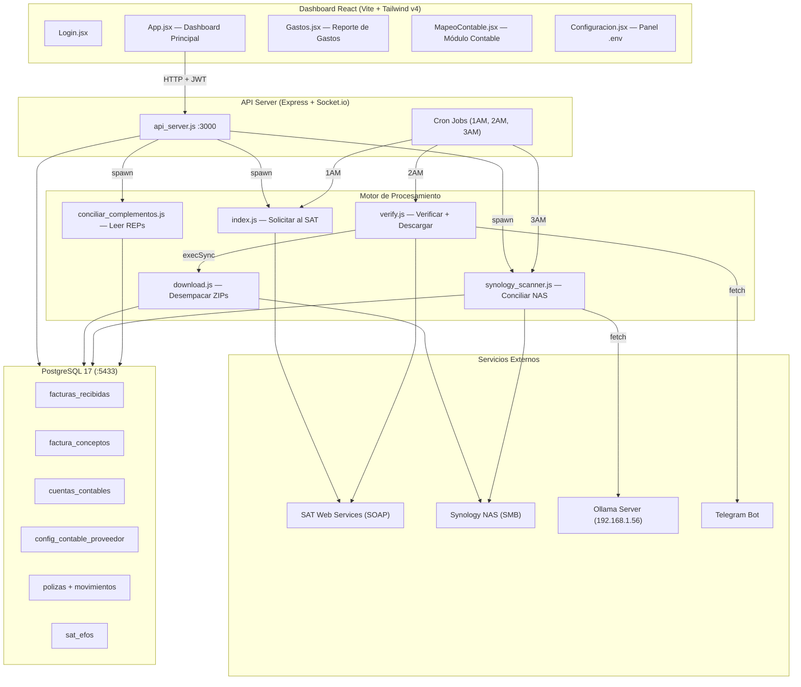
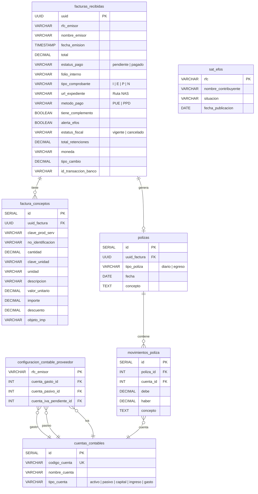

# 🔬 Análisis Profundo — APagos CWM

## Resumen Ejecutivo

**APagos** es un sistema de **tesorería automatizada** para la empresa CWM que conecta tres mundos:

1. **SAT** (Servicio de Administración Tributaria) — Descarga masiva de CFDIs vía Web Services
2. **NAS Synology (192.168.1.15)** — Almacenamiento de expedientes físicos y comprobantes de pago
3. **PostgreSQL 17** — Base de datos centralizada que une todo

El sistema está diseñado para correr **24/7 en un servidor Windows**, con cron jobs nocturnos que automatizan el ciclo completo sin intervención humana.

---

## Arquitectura del Sistema

---

## Flujo Operativo Nocturno (Automatizado)

| Hora | Script | Qué hace |
|------|--------|----------|
| **1:00 AM** | `index.js` | Genera solicitud de descarga masiva al SAT (facturas recibidas del año, tipo XML, solo vigentes). Guarda el `RequestId` en `last_request.txt` |
| **2:00 AM** | `verify.js` | Consulta al SAT si los paquetes están listos. Si sí → invoca `download.js` por cada paquete. Descarga ZIPs, extrae XMLs (incluyendo ZIPs anidados), parsea cada XML con regex, inserta en `facturas_recibidas` + `factura_conceptos`, y copia el XML al NAS organizado por `Año/Mes/RFC/UUID/`. Envía notificación por Telegram |
| **3:00 AM** | `synology_scanner.js` | Lee los 1,000 comprobantes más recientes de `//192.168.1.15/bancos/CWM`. Pipeline de 2 etapas: **Etapa 1** (local) busca coincidencias por RFC+Monto en texto del PDF/título del archivo, y por keywords del nombre del proveedor (FIFO). **Etapa 2** (IA) envía el documento a Ollama (glm-4.7-flash en 192.168.1.56) para extraer RFC y monto. Si hay match → copia el comprobante al expediente del NAS y marca como `pagado` en BD |

---

## Esquema de Base de Datos (Reconstruido del Código)

---

## Módulos del Dashboard (Frontend)

| Vista | Archivo | Funcionalidad |
|-------|---------|---------------|
| **Login** | [Login.jsx](file:///d:/apagos/dashboard-cwm/src/components/Login.jsx) | Autenticación JWT hardcodeada (`admin/secreto123`). Token con 8h de expiración |
| **Dashboard Principal** | [App.jsx](file:///d:/apagos/dashboard-cwm/src/App.jsx) | Tabla de facturas con KPIs (Pendientes, Pagado, Archivos, Retenciones). Filtros por año, mes, tipo, estatus. Paginación de 50. Acciones: subir pago manual, abrir carpeta NAS, eliminar pago, copiar UUID. Botones para disparar: Sync SAT, Escanear NAS, Leer XMLs |
| **Gastos** | [Gastos.jsx](file:///d:/apagos/dashboard-cwm/src/pages/Gastos.jsx) | Reporte tabular estilo Excel con ~25 columnas incluyendo conceptos desglosados, cuentas contables mapeadas, y estado de aprobación. Verificación dinámica de archivos de aprobación en el NAS. Exportación a CSV |
| **Contabilidad** | [MapeoContable.jsx](file:///d:/apagos/dashboard-cwm/src/components/MapeoContable.jsx) | Muestra proveedores "huérfanos" (sin cuentas asignadas). Permite mapear Gasto/Pasivo/IVA. Exporta Pólizas de Diario, Egreso y Reporte DIOT en formato CONTPAQi |
| **Configuración** | [Configuracion.jsx](file:///d:/apagos/dashboard-cwm/src/components/Configuracion.jsx) | Editor visual del `.env` (oculta contraseñas) |

---

## 🐛 Problemas y Deuda Técnica Detectados

### Seguridad (Críticos)

> [!CAUTION]
> 1. **Login hardcodeado** — Las credenciales `admin/secreto123` están escritas directamente en [api_server.js:132](file:///d:/apagos/api_server.js#L132). No existe tabla de usuarios ni hash de contraseñas.
> 2. **JWT Secret en código** — El fallback `'clave_super_secreta_desarrollo'` está expuesto en [api_server.js:117](file:///d:/apagos/api_server.js#L117). Falta `JWT_SECRET` en el `.env`.
> 3. **Endpoint de abrir explorador** — `/api/abrir-expediente` ejecuta `explorer` con una ruta proporcionada por el usuario sin sanitizar. Potencial inyección de comandos en [api_server.js:451](file:///d:/apagos/api_server.js#L451).
> 4. **Endpoint de config** — `/api/config POST` permite reescribir cualquier variable del `.env` desde el frontend. Un atacante autenticado podría cambiar credenciales de BD o del NAS.

### Arquitectura

> [!WARNING]
> 1. **URLs hardcodeadas** — `http://localhost:3000` está repetido ~15 veces en el frontend. No usa variables de entorno de Vite.
> 2. **Archivo monolítico** — [App.jsx](file:///d:/apagos/dashboard-cwm/src/App.jsx) tiene **766 líneas** con toda la lógica del dashboard en un solo componente.
> 3. **Sin routing** — La navegación entre vistas se maneja con flags booleanos (`mostrarConfig`, `mostrarContabilidad`, `mostrarGastos`) en lugar de React Router.
> 4. **Duplicación de código masiva** — La lógica de conexión NAS, la conexión a DB, y el parser de XML con regex se repite en **7+ archivos** sin compartir módulos.
> 5. **`reconciliation.js` es un prototipo muerto** — Tiene datos simulados hardcodeados y la línea 1 tiene un error de sintaxis (`reconciliation.js` como texto suelto).

### Rendimiento

> [!WARNING]
> 1. **Endpoint `/api/gastos`** — Hace `readdir` al NAS por cada fila para verificar aprobaciones. Con miles de facturas, esto genera cientos de llamadas de red SMB por request.
> 2. **Parser XML con Regex** — Funciona, pero los regex no manejan bien namespaces variables ni atributos con caracteres especiales. Un parser XML real (como `fast-xml-parser`) sería más robusto.
> 3. **IVA hardcodeado al 16%** — Los cálculos de subtotal/IVA asumen `total / 1.16` en lugar de leer los nodos `<cfdi:Traslados>` del XML. Esto falla con facturas exentas, tasa 0%, o con retenciones.

### Funcionalidad Incompleta

> [!NOTE]
> 1. **Tabla `polizas` y `movimientos_poliza`** — Fueron creadas por el setup pero **nunca se usan**. Las exportaciones a CONTPAQi generan texto plano en memoria sin guardar las pólizas en BD.
> 2. **Tabla `sat_efos`** — Fue creada pero **nunca se pobla**. No hay script para importar el listado del SAT ni para cruzar contra las facturas.
> 3. **Moneda extranjera** — El frontend muestra el tipo de cambio pero la BD no tiene `total_original_moneda` (el frontend lo referencia pero nunca llega del backend).
> 4. **Notificaciones WebSocket** — Solo se emiten al completar tareas pesadas. No hay feedback de progreso en tiempo real (ej. "Procesando XML 150 de 3,000").
> 5. **Sin manejo de multi-tenancy** — Todo está configurado para un solo RFC (CWM). No soporta múltiples empresas.

---

## ✅ Lo Que Funciona Bien

- El flujo completo **SAT → ZIP → XML → DB → NAS** está sólido y automatizado
- El pipeline de conciliación híbrido (local + Ollama) es un diseño innovador
- El "candado PPD/PUE" para bloquear egresos sin complemento es una buena regla de negocio
- Las exportaciones a CONTPAQi (Diario, Egreso, DIOT) cubren los 3 reportes más críticos
- La UI de React usa un design system oscuro coherente con Tailwind v4
- Notificaciones por Telegram al completar descargas del SAT

---

## 🚀 Qué Sigue — Próximos Pasos Sugeridos

### Prioridad Alta (Producción)
| # | Tarea | Impacto |
|---|-------|---------|
| 1 | **Implementar autenticación real** — Tabla de usuarios con bcrypt, roles (admin/viewer), y JWT_SECRET en `.env` | Seguridad |
| 2 | **Extraer módulos compartidos** — Crear `lib/db.js`, `lib/nas.js`, `lib/xml-parser.js` para eliminar duplicación | Mantenibilidad |
| 3 | **Centralizar URL del API** — Variable de entorno de Vite (`VITE_API_URL`) usada desde un helper | Mantenibilidad |
| 4 | **Calcular IVA/subtotal real desde XML** — Leer nodos `<cfdi:Traslados>` y `<cfdi:Retenciones>` en lugar de dividir entre 1.16 | Precisión fiscal |
| 5 | **Sanitizar ruta en `/api/abrir-expediente`** — Validar que la ruta inicie con la base del NAS antes de ejecutar `explorer` | Seguridad |

### Prioridad Media (Funcionalidad)
| # | Tarea | Impacto |
|---|-------|---------|
| 6 | **Poblar tabla EFOS** — Script para importar CSV del Art. 69-B del SAT y cruzar con facturas existentes | Cumplimiento |
| 7 | **Guardar pólizas en BD** — Usar tablas `polizas` y `movimientos_poliza` para tener historial contable auditable | Contabilidad |
| 8 | **React Router** — Reemplazar flags booleanos por rutas reales (`/gastos`, `/contabilidad`, `/config`) | UX |
| 9 | **Progreso en tiempo real** — Emitir eventos WebSocket durante el procesamiento (no solo al final) | UX |
| 10 | **Dashboard de métricas** — Gráficas de gastos por mes, por proveedor, concentración de riesgo, etc. | Valor de negocio |

### Prioridad Baja (Nice to Have)
| # | Tarea | Impacto |
|---|-------|---------|
| 11 | **Conciliación bancaria real** — Importar estados de cuenta (CSV/OFX) y cruzar automáticamente vs facturas (evolución de `reconciliation.js`) | Automatización |
| 12 | **Multi-empresa** — Permitir gestionar múltiples RFCs desde el mismo dashboard | Escalabilidad |
| 13 | **Cacheo de aprobaciones** — Guardar el estatus de aprobación en BD en lugar de leer del NAS en cada request | Performance |
| 14 | **Tests automatizados** — Al menos tests de integración para los endpoints de la API | Calidad |
| 15 | **Dockerizar** — Empaquetar backend + frontend + PostgreSQL para despliegue reproducible | DevOps |

---

## Resumen de Archivos

| Archivo | Líneas | Rol |
|---------|--------|-----|
| [api_server.js](file:///d:/apagos/api_server.js) | 773 | API REST + Cron + WebSockets |
| [App.jsx](file:///d:/apagos/dashboard-cwm/src/App.jsx) | 766 | Dashboard principal React |
| [Gastos.jsx](file:///d:/apagos/dashboard-cwm/src/pages/Gastos.jsx) | 379 | Reporte de gastos |
| [synology_scanner.js](file:///d:/apagos/synology_scanner.js) | 292 | Pipeline conciliación NAS+IA |
| [download.js](file:///d:/apagos/download.js) | 264 | Descarga e ingesta de XMLs |
| [MapeoContable.jsx](file:///d:/apagos/dashboard-cwm/src/components/MapeoContable.jsx) | 258 | Módulo contable React |
| [importar_historicos.js](file:///d:/apagos/importar_historicos.js) | 134 | Importación masiva de XMLs existentes |
| [update_folios.js](file:///d:/apagos/update_folios.js) | 119 | Actualizar folios/tipo desde XMLs |
| [update_folios_xml.js](file:///d:/apagos/update_folios_xml.js) | 114 | Versión alternativa de actualización |
| [importar_cuentas.js](file:///d:/apagos/importar_cuentas.js) | 107 | Importar catálogo contable desde CSV |
| [index.js](file:///d:/apagos/index.js) | 102 | Solicitud de descarga al SAT |
| [reconciliation.js](file:///d:/apagos/reconciliation.js) | 92 | ⚠️ Prototipo no funcional (datos simulados) |
| [setup_contabilidad.js](file:///d:/apagos/setup_contabilidad.js) | 91 | Crear tablas contables |
| [verify.js](file:///d:/apagos/verify.js) | 89 | Verificar solicitud SAT + detonar descarga |
| [conciliar_complementos.js](file:///d:/apagos/conciliar_complementos.js) | 73 | Cruzar complementos de pago XML |
| [Login.jsx](file:///d:/apagos/dashboard-cwm/src/components/Login.jsx) | 52 | Pantalla de login |
| [setup_efos.js](file:///d:/apagos/setup_efos.js) | 43 | Crear tabla EFOS |
| [setup_candado_iva.js](file:///d:/apagos/setup_candado_iva.js) | 29 | Agregar columnas PPD/PUE |
